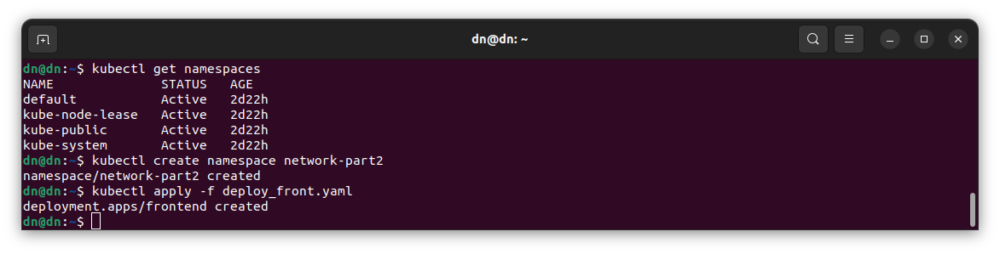
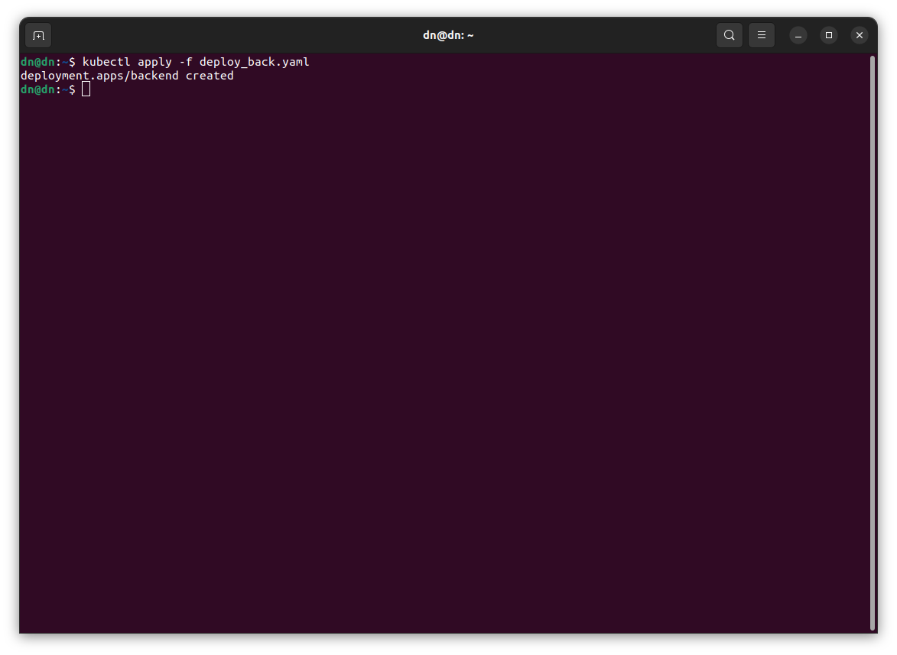
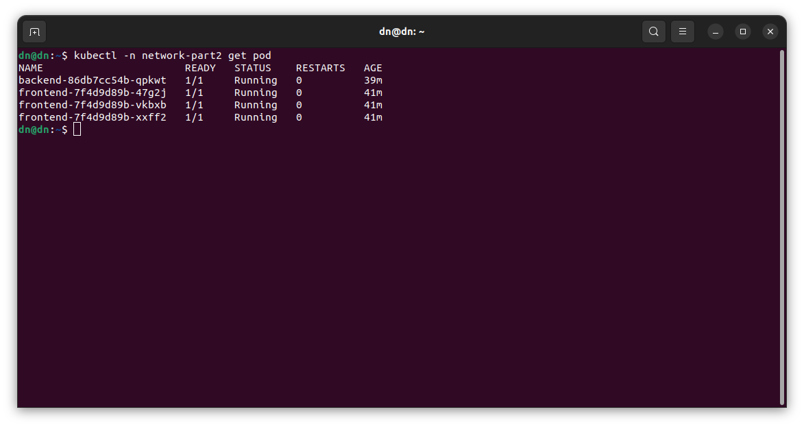
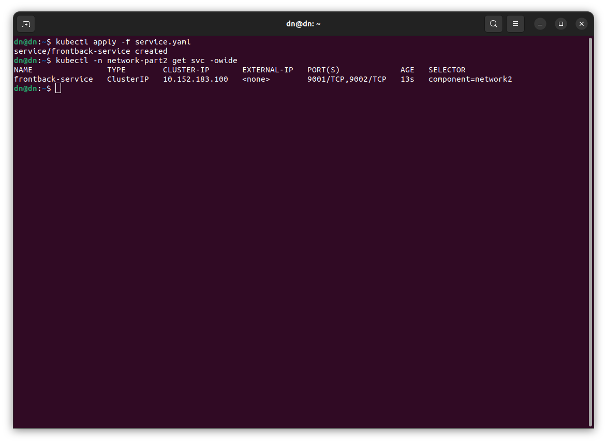
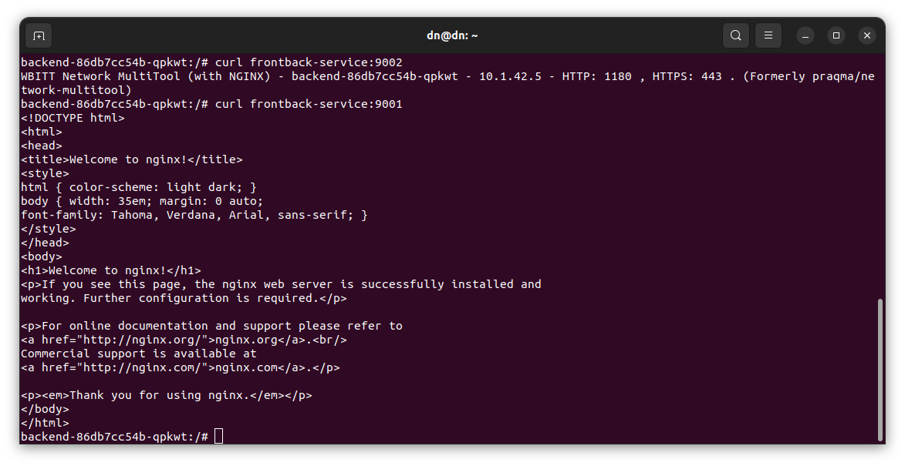
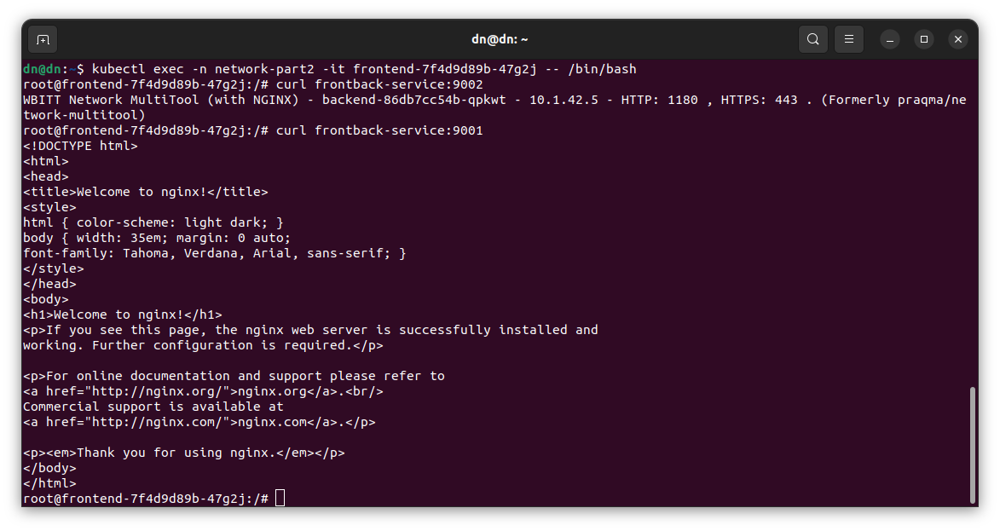
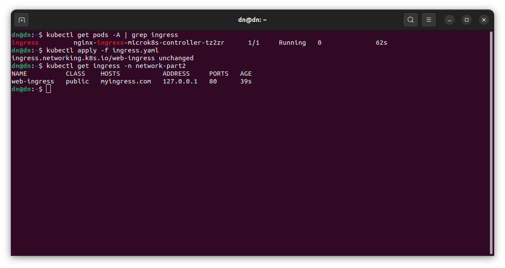
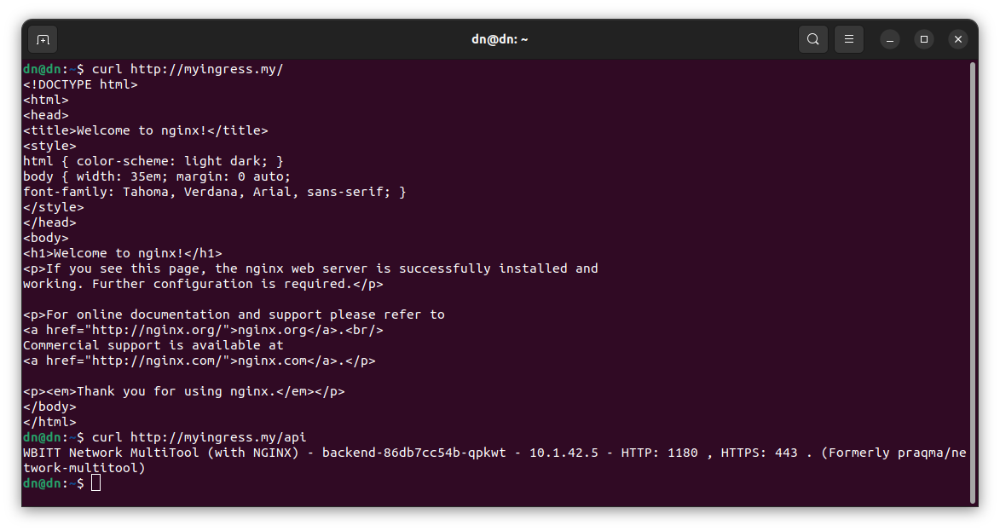

# Никоноров Денис - FOPS-8

# Домашнее задание к занятию «Сетевое взаимодействие в K8S. Часть 2»

### Задание 1. Создать Deployment приложений backend и frontend

1. Создать Deployment приложения _frontend_ из образа nginx с количеством реплик 3 шт.
2. Создать Deployment приложения _backend_ из образа multitool. 
3. Добавить Service, которые обеспечат доступ к обоим приложениям внутри кластера. 
4. Продемонстрировать, что приложения видят друг друга с помощью Service.
5. Предоставить манифесты Deployment и Service в решении, а также скриншоты или вывод команды п.4.

------

### Задание 2. Создать Ingress и обеспечить доступ к приложениям снаружи кластера

1. Включить Ingress-controller в MicroK8S.
2. Создать Ingress, обеспечивающий доступ снаружи по IP-адресу кластера MicroK8S так, чтобы при запросе только по адресу открывался _frontend_ а при добавлении /api - _backend_.
3. Продемонстрировать доступ с помощью браузера или `curl` с локального компьютера.
4. Предоставить манифесты и скриншоты или вывод команды п.2.

---

### Решение задания 1. Создать Deployment приложений backend и frontend

Для выполнения задания создан отдельный namespace `network-part2`. Написан манифест приложения [deployment-frontend](/deployment_front.yml) c 3-мя репликами и образом nginx.

Написан манифест приложения [deployment-backend](/deployment_back.yml) c образом multitool.

Проверка созданныз подов.

Написан манифест Сервиса [service](/service.yml) который обеспечивает доступ к обоим приложениям внутри кластера. Также указан selector типа component

Использован curl для проверки доступности приложений в поде backend

Видно что back видит front, и наооборот.

### Решение задания 2. Создать Ingress и обеспечить доступ к приложениям снаружи кластера

Включен Ingress в MicroK8S. `microk8s enable ingress`

Проверка его состояния. Написан манифест [ingress](/ingress.yml) и запущен.

Для проверки доступа с помощью браузера или `curl` с локальной машины в '/etc/hosts` добавлена запись чтобы ingress адрес ссылался на IP адресс кластера Microk8s

Проверяем:

Видно что при обращении к http://myingress.my/ ответ получен от Nginx, а при обращении к http://myingress.my/api ответ получен от multitool